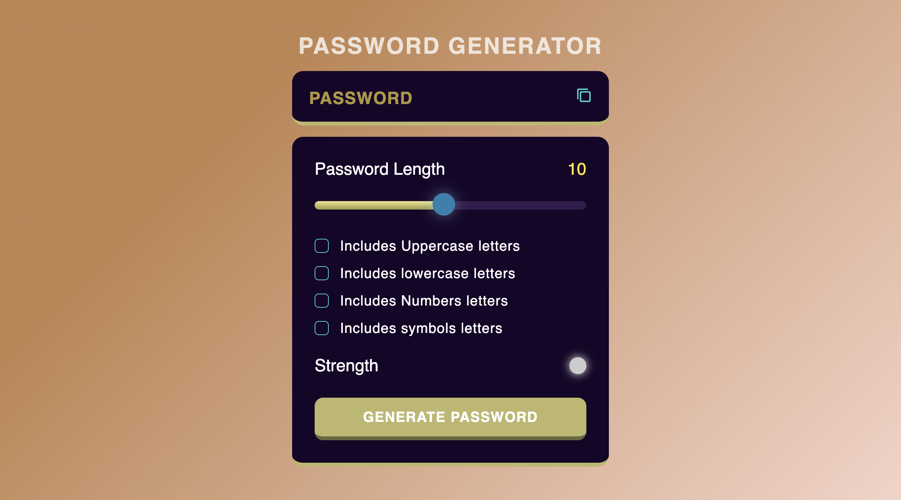
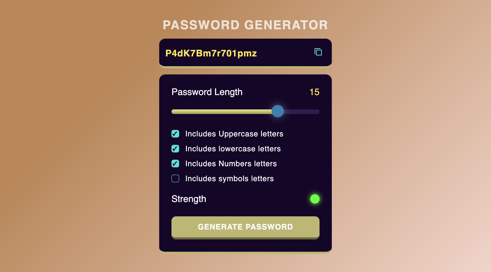

# 🔐 Password Generator Web Application

This is a **Frontend Project** built with **HTML, CSS, and JavaScript** that generates strong and secure passwords based on user-defined criteria. The goal of this project is to help users create complex passwords that are difficult to guess or crack, enhancing overall online security.

---

## 🚀 Features

- ✅ User-defined password length
- 🔠 Option to include:
  - Uppercase letters
  - Lowercase letters
  - Numbers
  - Special characters
- 🔁 Randomized password generation
- 📋 Copy-to-clipboard functionality

---

## 🛠 Technologies Used

- **HTML** – Structure and layout
- **CSS** – Styling and responsive design
- **JavaScript** – Core logic for password generation and interactivity

---

## 📸 Demo

> 
>   

---

## 💡 How It Works

1. The user selects their preferred password criteria (length and character types).
2. The app generates a random password that meets those requirements.
3. The password is displayed instantly for the user to copy and use.

---

## 📁 Project Setup

No build tools required. Simply download or clone the repository and open `index.html` in your browser or Go Live from VS Code:

```bash
git clone https://github.com/paveshkanungo/Password-Generator-Project.git
cd password-generator-vercel-repo
```

---